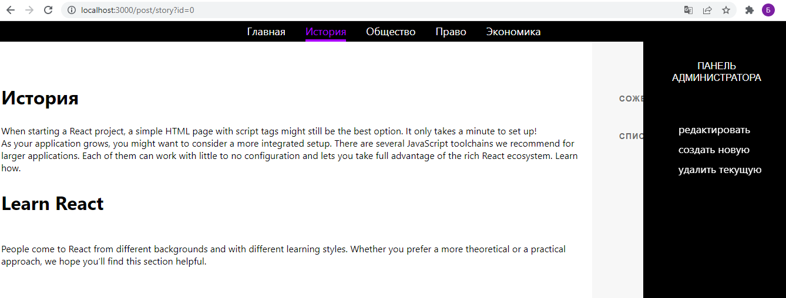

# Application description
his is a [Next.js](https://nextjs.org/) project bootstrapped with [`create-next-app`](https://github.com/vercel/next.js/tree/canary/packages/create-next-app).

## Getting Started

First, run the development server:

```bash
npm run dev
# or
yarn dev
```

Open [http://localhost:3000](http://localhost:3000)
- Works with a test database
-   Access to the admin panel: **email - bogdan_info@mail.ru, password - 123456**
---


[https://olga-marchukova.ru](https://olga-marchukova.ru/) - **Under development**

### Programming language:


### Technologies:
Next.js API

### Additional technologies and frameworks

- text editor - Draft.js
- state manager - Redux
- Database - MongoDb
- Testing - Jest
- Rest API - Next.js API
- reverse proxy - NGiNX

# About the project
A personal website of a history teacher. It will host resources for preparing for exams. It is also planned to conduct **interactive testing**.

All articles are added through the admin panel. To do this, use framework - [**Draft.js**](https://draftjs.org/)

Articles are rendered on the server, render functionality implemented independently

## Admin Panel
Run the app locally


**Move your mouse cursor to the right side of the screen**



